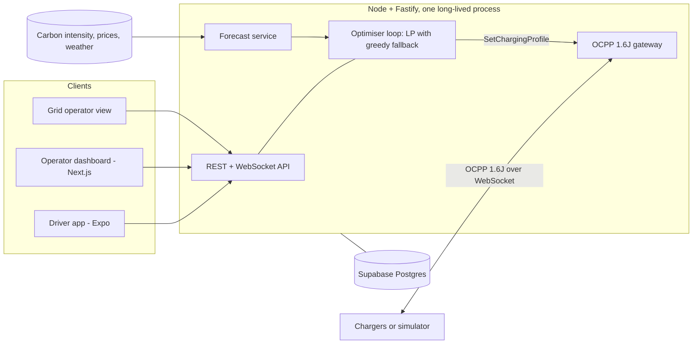

# CleanGrid EV

Renewable-aware EV charging for a single site. CleanGrid EV sits between the grid, the chargers and the driver. It moves each car's charging into the cleanest and cheapest hours of its parked window, never misses the driver's deadline, keeps the site under its grid connection, and reports the CO2 it avoided from meter readings.

Hackathon build. Theme: Renewable Energy Intelligence.

## Why it works

Electricity is not stored at grid scale, so the generation mix changes through the day. Midday solar can bring the grid down to about 200 gCO2/kWh, while the evening peak pushes it to about 700. A car parked for nine hours often needs only four hours of charging. CleanGrid EV uses that slack.

## How it works

The planning window is split into 15-minute slots over a rolling 24 hours. A linear program decides the power for every session in every slot. It must deliver each car's energy before its deadline, respect each car's power limit and the site's grid connection, and it minimises a weighted blend of energy cost, peak demand and CO2. Drivers pick the blend as a mode: cheapest, greenest, fastest or balanced. The first slot of each plan is sent to the chargers as an OCPP SetChargingProfile, and the plan is re-solved on every plug-in, unplug and forecast change.

## Build progress

- [x] Plan: open decisions, task order, schema, API, screens, risks ([docs/PLAN.md](docs/PLAN.md))
- [x] Monorepo scaffold (npm workspaces, TypeScript, Vitest)
- [ ] Shared domain model, slot grid, simulated clock
- [ ] Scheduling engine: greedy
- [ ] OCPP 1.6J framing and gateway
- [ ] Charger simulator
- [ ] Dispatcher: plan to SetChargingProfile
- [ ] Optimiser loop and end-to-end terminal demo
- [ ] Scheduling engine: linear program (HiGHS)
- [ ] Forecast service: UK Carbon Intensity, Octopus Agile, Open-Meteo
- [ ] Avoided-emissions reporting
- [ ] REST and WebSocket API
- [ ] Supabase schema and row-level security
- [ ] Operator dashboard
- [ ] Driver app
