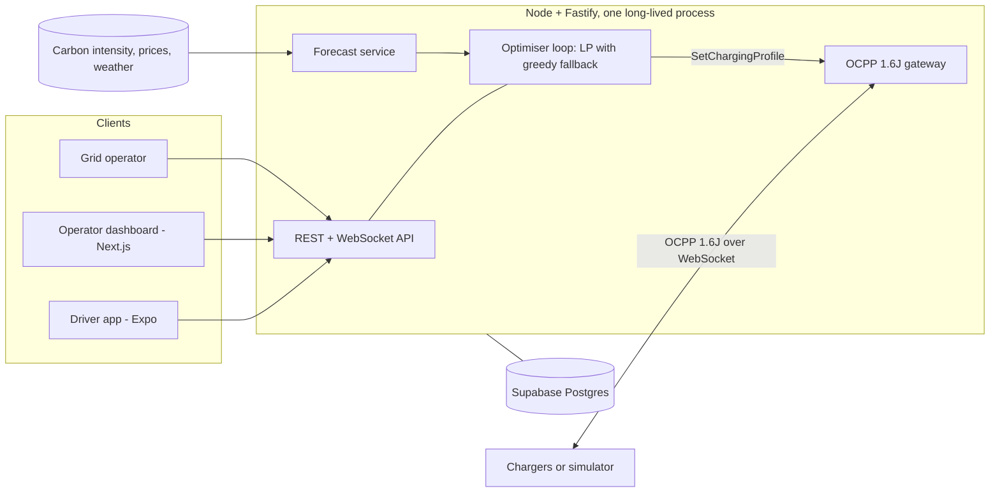

# CleanGrid EV

Renewable-aware EV charging across a network of sites. CleanGrid EV sits between the grid, the
chargers and the driver. It moves each car's charging into the cleanest and cheapest hours of its
parked window, never misses the driver's deadline, keeps each site under its grid connection, and
reports the CO2 it avoided from meter readings.

The demo network is four Gujarat sites — Gandhinagar, Ahmedabad, Vadodara and Surat — plus one in
Britain. They are there to be different from one another: an office campus with eight hours of
slack, a retail plaza with ninety minutes, an overnight delivery depot, a three-shift logistics
yard, and a British car park whose grid data arrives fully measured. Each is a different shape of
the same problem, and each gets its own live forecast.

Hackathon build. Theme: Renewable Energy Intelligence.

## Why it works

Electricity is not stored at grid scale, so the generation mix changes through the day. Midday
solar can bring the grid down to about 200 gCO2/kWh, while the evening peak pushes it to about 700.
Same electricity, roughly three times the emissions, depending only on when you draw it. A car
parked for nine hours often needs four hours of charging. CleanGrid EV uses that slack.

One simulated day at the Gandhinagar site, measured from charger meter readings. The same six
cars and the same six deadlines, run twice — once with the optimiser off, so every car charges
flat out from the moment it is plugged in, and once with it on:

| | Charging on plug-in | CleanGrid EV |
|---|---|---|
| Cost | ₹989.72 | ₹644.75 |
| Cost per kWh | ₹5.68 | ₹5.28 |
| CO2 | 67.0 kg | 44.0 kg |
| CO2 per kWh | 385 g | 360 g |
| Peak site draw | 121.2 kW | 112.2 kW |
| Quarter-hours above the 120 kW connection | 3 | 0 |
| Deadlines met | 6 of 6 | 6 of 6 |

23 kg of CO2 and ₹345 saved in a day at one small car park, and the site never goes over its
connection — the unplanned run breaches it three times, which is the half-hour that sets the
month's demand charge.

Two different savings are stacked there, and the table separates them on purpose. Some of it is
timing: the same kWh bought in cleaner, cheaper hours, which is the per-kWh rows. The rest is that
a charger with no plan cannot know what a driver actually asked for, so it fills the battery — 52
kWh more than anyone requested. Both are real, and conflating them would overstate the case.

Reproduce it with `node scripts/compare.mjs --scenario ./scenarios/gandhinagar-secretariat.json`.
Every figure comes from charger meter readings, not from the plan.

## How it works



The planning window is 24 rolling hours in 15-minute slots. A linear program decides the power for
every session in every slot, subject to each car getting its energy before its deadline, its own
power limit, its plugged-in window, and the site's grid connection. It minimises a weighted blend
of energy cost, peak demand and CO2; drivers choose the blend as a mode. The first slot is sent to
the chargers as an OCPP SetChargingProfile, and the whole plan is re-solved on every plug-in,
unplug, deadline change and flexibility request.

If the solver fails for any reason, a greedy scheduler produces the plan instead and the dashboard
says so. If a deadline cannot physically be met, the driver is told at intake, with the earliest
time that can be met.

## Run it

```bash
npm install
npm test                 # 301 tests
npm run demo             # one simulated day, end to end, in about 13 minutes
```

`npm run demo` starts the server on a simulated clock, connects eight simulated OCPP chargers,
replays fourteen arrivals, and prints what each driver got and what the site saved. Useful flags:

```bash
node scripts/demo.mjs --scale 240      # faster: a day in about 6 minutes
node scripts/demo.mjs --port 8085      # if 8080 is taken
node scripts/demo.mjs --scheduler greedy
```

Run the pieces separately:

```bash
npm run dev:server                     # API on :8080, OCPP on ws://localhost:8080/ocpp/<id>
npm run dev:sim                        # simulated chargers replaying the scenarios
npm run dev:dashboard                  # operator dashboard on :3000
node scripts/build-apk.mjs --api http://<lan-ip>:8080 --install   # driver app onto a phone
```

Server and simulator both default to the same five scenarios, from `DEFAULT_SCENARIOS` in
`packages/shared`, so they agree about which sites exist without being told twice. `SCENARIO` (on
the server) and `--scenario` (on the simulator) override it; change one and change the other.

The simulated day starts at the earliest arrival across the loaded sites, which is Surat's 06:20
shift. To open at a busier moment instead, give `SIM_START` an instant: `SIM_START=2026-09-12T12:00:00Z`
is half past five in the evening in Gujarat, with three of the four sites working.

Configuration lives in `.env.example`. The two that matter most are `SIM_TIME_SCALE` (how fast the
simulated day runs) and `FORECAST` (`synthetic` for deterministic offline data, `live` for the UK
Carbon Intensity API, Octopus Agile prices and Open-Meteo weather, none of which need a key).

## What is in here

| Path | What it holds |
|---|---|
| `packages/shared` | Domain model, slot grid, simulated clock, scheduler contract, request schemas, scenario format |
| `packages/engine` | The scheduling engine: LP on HiGHS, greedy fallback, validation, deadline feasibility, avoided-emissions reporting. No IO |
| `packages/ocpp` | OCPP 1.6J framing, typed messages, meter-value parsing |
| `apps/server` | Fastify API, OCPP gateway, optimiser loop, dispatcher, forecast service, impact reports |
| `apps/simulator` | Simulated charge points with a vehicle model, and a driver-app actor |
| `apps/dashboard` | Operator dashboard (Next.js) |
| `apps/driver` | Driver app (Expo) |
| `supabase/` | Postgres schema and row-level security |
| `scenarios/*.json` | The sites: four in Gujarat, one in Britain. See below |
| `docs/` | Decisions, tasks, risks, schema, API, screens, dashboard, review |

## The sites

| Scenario | Site | The problem it poses |
|---|---|---|
| `gandhinagar-secretariat.json` | Gandhinagar Secretariat Car Park, 8 × 22 kW, 120 kW connection | Office hours: eight hours of slack against Gujarat's midday solar. The easy case, and the one that saves the most |
| `ahmedabad-ashram-road.json` | Ahmedabad Ashram Road Plaza, 6 × 22 kW + 4 × 60 kW, 200 kW | Retail: ninety-minute dwells on DC bays that would take the whole connection together. Almost no slack, so the limit has to be shared rather than planned around |
| `vadodara-alkapuri-depot.json` | Vadodara Alkapuri Depot, 6 × 30 kW, 150 kW | Overnight vans, full by the 06:00 dispatch. Gujarat's nights are its cheapest hours and its dirtiest, so cost and carbon disagree here |
| `surat-textile-park.json` | Surat Textile Park Yard, 6 × 22 kW + 3 × 60 kW, 180 kW | Three shifts round the clock, with a base load already at two thirds of the connection. The peak-shaving case |
| `day-one.json` | Riverside Office Car Park, 8 × 22 kW, 65 kW | Britain, where carbon and price both arrive measured rather than modelled. Includes one impossible request, to show the refusal |
| `evening-peak.json` | Riverside again, evening arrivals | An alternative day at the same site; never loaded alongside `day-one` |

## Where the numbers come from

Nothing on a screen is presented as measured unless it was measured, and every forecast carries the
name of what produced it.

| Signal | Great Britain | Gujarat |
|---|---|---|
| Carbon intensity | National Grid ESO, forecast and settled actuals | Gujarat grid profile, corrected by live weather. Electricity Maps replaces it outright if `ELECTRICITY_MAPS_TOKEN` is set |
| Price | Octopus Agile, the site's distribution region | GERC time-of-day commercial tariff shape |
| Renewable share | ESO generation mix for hours already past, implied by carbon for hours ahead | Modelled share scaled by how today's sun and wind compare with normal here |
| Weather | Open-Meteo | Open-Meteo |

The weather step is the part that travels. Irradiance is read against the clear-sky maximum for
that latitude, day and hour, so "a bright afternoon" means the same thing in Surat and in London;
wind is taken at hub height and put through a turbine power curve; and the two are weighted by what
the grid in question is actually built out of. A still, sunny hour is a good one for Gujarat and a
poor one for Britain, and the same arithmetic says so for both.

## Documentation

- [Decisions](docs/DECISIONS.md): every open question, the options, and what was chosen
- [Tasks](docs/TASKS.md): build order and what blocks what
- [Risks](docs/RISKS.md): what could go wrong and the fallback that is built for it
- [Schema](docs/SCHEMA.md) and [API](docs/API.md)
- [Driver screens](docs/SCREENS.md) and [Dashboard](docs/DASHBOARD.md)
- [Review](docs/REVIEW.md): where the build drifted from the plan, and what the review found
- [Original plan](docs/PLAN.md)

## Build progress

- [x] Plan: open decisions, task order, schema, API, screens, risks
- [x] Monorepo scaffold (npm workspaces, TypeScript, Vitest)
- [x] Shared domain model, slot grid, simulated clock
- [x] Scheduling engine: greedy
- [x] OCPP 1.6J framing and gateway
- [x] Charger simulator
- [x] Dispatcher: plan to SetChargingProfile
- [x] Optimiser loop and end-to-end terminal demo
- [x] Scheduling engine: linear program (HiGHS)
- [x] Forecast service: UK Carbon Intensity, Octopus Agile, Open-Meteo
- [x] Avoided-emissions reporting
- [x] REST and WebSocket API
- [x] Supabase schema and row-level security
- [x] Operator dashboard
- [x] Driver app
- [ ] Supabase repository implementation (interfaces and SQL are ready)
