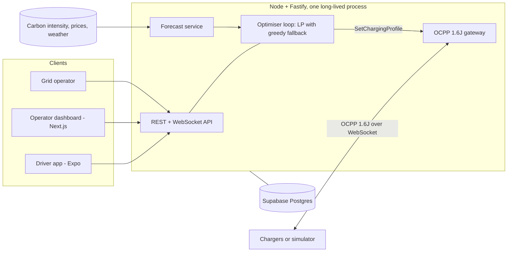

# CleanGrid EV

Renewable-aware EV charging for a single site. CleanGrid EV sits between the grid, the chargers and
the driver. It moves each car's charging into the cleanest and cheapest hours of its parked window,
never misses the driver's deadline, keeps the site under its grid connection, and reports the CO2
it avoided from meter readings.

Hackathon build. Theme: Renewable Energy Intelligence.

## Why it works

Electricity is not stored at grid scale, so the generation mix changes through the day. Midday
solar can bring the grid down to about 200 gCO2/kWh, while the evening peak pushes it to about 700.
Same electricity, roughly three times the emissions, depending only on when you draw it. A car
parked for nine hours often needs four hours of charging. CleanGrid EV uses that slack.

One simulated day at the demo site, measured from charger meter readings:

| | Smart charging | Charging on plug-in |
|---|---|---|
| Energy delivered | 382 kWh | 382 kWh |
| Cost | £56 | £83 |
| CO2 | 91 kg | 141 kg |
| Peak site draw | 64 kW | over 90 kW |
| Deadlines met | 14 of 14 | 14 of 14 |

50 kg of CO2 avoided and a third off the bill, with the site inside its 65 kW connection all day.
A dumb site would have drawn over 90 kW during the morning rush. Every figure comes from charger
meter readings, not from the plan.

## How it works



The planning window is 24 rolling hours in 15-minute slots. A linear program decides the power for
every session in every slot, subject to each car getting its energy before its deadline, its own
power limit, its plugged-in window, and the site's grid connection. It minimises a weighted blend
of energy cost, peak demand and CO2; drivers choose the blend as a mode. The first slot is sent to
the chargers as an OCPP SetChargingProfile, and the whole plan is re-solved on every plug-in,
unplug, deadline change and flexibility request.

If the solver fails for any reason, a greedy scheduler produces the plan instead and the dashboard
says so. If a deadline cannot physically be met, the driver is told at intake, with the earliest
time that can be met.

## Run it

```bash
npm install
npm test                 # 209 tests
npm run demo             # one simulated day, end to end, in about 13 minutes
```

`npm run demo` starts the server on a simulated clock, connects eight simulated OCPP chargers,
replays fourteen arrivals, and prints what each driver got and what the site saved. Useful flags:

```bash
node scripts/demo.mjs --scale 240      # faster: a day in about 6 minutes
node scripts/demo.mjs --port 8085      # if 8080 is taken
node scripts/demo.mjs --scheduler greedy
```

Run the pieces separately:

```bash
npm run dev:server                     # API on :8080, OCPP on ws://localhost:8080/ocpp/<id>
npm run dev:sim                        # simulated chargers replaying the scenario
npm run dev:dashboard                  # operator dashboard on :3000
npm start -w apps/driver               # driver app in Expo Go
```

Configuration lives in `.env.example`. The two that matter most are `SIM_TIME_SCALE` (how fast the
simulated day runs) and `FORECAST` (`synthetic` for deterministic offline data, `live` for the UK
Carbon Intensity API, Octopus Agile prices and Open-Meteo weather, none of which need a key).

## What is in here

| Path | What it holds |
|---|---|
| `packages/shared` | Domain model, slot grid, simulated clock, scheduler contract, request schemas, scenario format |
| `packages/engine` | The scheduling engine: LP on HiGHS, greedy fallback, validation, deadline feasibility, avoided-emissions reporting. No IO |
| `packages/ocpp` | OCPP 1.6J framing, typed messages, meter-value parsing |
| `apps/server` | Fastify API, OCPP gateway, optimiser loop, dispatcher, forecast service, impact reports |
| `apps/simulator` | Simulated charge points with a vehicle model, and a driver-app actor |
| `apps/dashboard` | Operator dashboard (Next.js) |
| `apps/driver` | Driver app (Expo) |
| `supabase/` | Postgres schema and row-level security |
| `scenarios/day-one.json` | One site, eight chargers, fourteen arrivals |
| `docs/` | Decisions, tasks, risks, schema, API, screens, dashboard, review |

## Documentation

- [Decisions](docs/DECISIONS.md): every open question, the options, and what was chosen
- [Tasks](docs/TASKS.md): build order and what blocks what
- [Risks](docs/RISKS.md): what could go wrong and the fallback that is built for it
- [Schema](docs/SCHEMA.md) and [API](docs/API.md)
- [Driver screens](docs/SCREENS.md) and [Dashboard](docs/DASHBOARD.md)
- [Review](docs/REVIEW.md): where the build drifted from the plan, and what the review found
- [Original plan](docs/PLAN.md)

## Build progress

- [x] Plan: open decisions, task order, schema, API, screens, risks
- [x] Monorepo scaffold (npm workspaces, TypeScript, Vitest)
- [x] Shared domain model, slot grid, simulated clock
- [x] Scheduling engine: greedy
- [x] OCPP 1.6J framing and gateway
- [x] Charger simulator
- [x] Dispatcher: plan to SetChargingProfile
- [x] Optimiser loop and end-to-end terminal demo
- [x] Scheduling engine: linear program (HiGHS)
- [x] Forecast service: UK Carbon Intensity, Octopus Agile, Open-Meteo
- [x] Avoided-emissions reporting
- [x] REST and WebSocket API
- [x] Supabase schema and row-level security
- [x] Operator dashboard
- [x] Driver app
- [ ] Supabase repository implementation (interfaces and SQL are ready)
